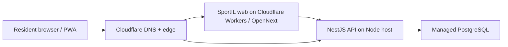

# Cloudflare And Production Deployment

Last updated: 2026-06-19 01:14 IDT

Domain selected: `gosport.co.il`

## Status

Local P0 is implemented enough for an operator demo, but public production beta is not complete.

Ready now:

- Web can build as a regular Next.js app.
- Web can build as a Cloudflare Workers artifact through OpenNext.
- Wrangler dry-run can read the `.open-next` artifact and produce an upload plan.
- API has production health endpoints: `/healthz` and `/readyz`.
- API CORS is environment-controlled with `SPORTIL_ALLOWED_ORIGINS`.
- Development role headers are rejected when `NODE_ENV=production`.
- API has a root `Dockerfile.api` for Node hosting.
- Root `.env.example` documents required deployment variables.

Still blocking public beta:

- Real server-side auth/session and RBAC claims are not implemented.
- Booking mutations currently rely on prototype identity in non-production only.
- Real payment provider and webhook idempotency are not implemented.
- Real SportSync/live inventory connectors are not implemented.
- Legal/privacy retention text for resident profile and family data is still a draft concern.
- API container build could not be verified locally because Docker is not installed on this machine.

## Recommended Topology

Use Cloudflare for web, DNS, edge security, preview links, and optionally Access. Keep the NestJS + Prisma API on a normal Node runtime.



Rationale:

- Cloudflare's current Next.js guidance points full Next.js apps to Cloudflare Workers using the OpenNext adapter.
- OpenNext supports App Router, SSR, SSG, route handlers, server components, ISR, server actions, middleware, and Next.js 16.
- The current API is NestJS + Prisma + PostgreSQL. That should run on a Node host, not inside Workers, unless we deliberately rewrite the API boundary.

## Cloudflare Web

Files added:

- `apps/web/wrangler.jsonc`
- `apps/web/open-next.config.ts`
- `apps/web/public/_headers`

Commands:

```bash
NEXT_PUBLIC_SPORTIL_API_BASE_URL=https://api.gosport.co.il/api/v1 corepack pnpm --filter @sportil/web cf:build
NEXT_PUBLIC_SPORTIL_API_BASE_URL=https://api.gosport.co.il/api/v1 corepack pnpm deploy:web:cf
```

Configured Worker custom domains:

- `gosport.co.il`
- `www.gosport.co.il`

Required Cloudflare secrets/environment:

- `CLOUDFLARE_ACCOUNT_ID`
- `CLOUDFLARE_API_TOKEN`
- `NEXT_PUBLIC_SPORTIL_API_BASE_URL`

Verified locally:

- `corepack pnpm --filter @sportil/web cf:build` completes.
- `wrangler deploy --dry-run --outdir .wrangler-dry-run` completes with total gzip upload around 966 KiB.

Local caveat:

- `workerd` warns that this macOS is below 13.5, so local Workers runtime preview may be unreliable here. CI or a Linux dev container should be used for final Cloudflare preview.

## API

Files added:

- `Dockerfile.api`
- `.dockerignore`

Commands:

```bash
DATABASE_URL=postgresql://... corepack pnpm build:api
docker build -f Dockerfile.api -t sportil-api:local .
```

Required API environment:

- `NODE_ENV=production`
- `PORT=4000`
- `DATABASE_URL`
- `SPORTIL_ALLOWED_ORIGINS=https://gosport.co.il,https://www.gosport.co.il`
- `SPORTIL_DEV_AUTH=false`

Verified locally without Docker:

- `NODE_ENV=production ... corepack pnpm --filter @sportil/api build` passes.
- `GET /healthz` returns `200`.
- `GET /readyz` returns `200` against local PostgreSQL.
- Production API rejects `x-sportil-dev-role` with `401`.
- Production CORS responds only with configured origin and `content-type` header.

## Database

Recommended immediate managed PostgreSQL providers:

- Neon
- Supabase
- Railway Postgres
- Render Postgres

Deploy steps:

```bash
DATABASE_URL=postgresql://... corepack pnpm db:migrate
DATABASE_URL=postgresql://... corepack pnpm db:seed
```

Production note:

- Seed data contains source-backed and manually reviewed Netanya catalog data. Before public launch, mark unverified inventory as contact/request-only unless a live source or operator confirms it.

## Release Modes

### Protected stakeholder demo

Use Cloudflare Access or a private tunnel. This can run with non-production demo auth because access is restricted.

Use when:

- sharing progress with a small group;
- no real payments;
- no public booking commitments.

### Public catalog preview

Can be exposed publicly only if mutation flows are disabled or guarded by production auth.

Use when:

- showing search, facility detail, calendar, map, PWA shell;
- collecting no sensitive resident data;
- presenting booking as "request/contact" rather than final confirmed booking.

### Public beta

Blocked until real auth/session is implemented.

Minimum required before public beta:

1. HttpOnly server-side sessions and session store.
2. Production RBAC claims for resident/operator/admin.
3. CSRF/session protection for mutations.
4. Authenticated profile/saved/bookings pages.
5. Real booking confirmation policy by source confidence.
6. Privacy/retention copy for family data.
7. Payment provider decision before any money movement.

## Cloudflare Account Checklist

Needed from the owner:

- Cloudflare account access.
- Domain name: `gosport.co.il`.
- API hostname: `api.gosport.co.il`.
- Web hostnames: `gosport.co.il` and `www.gosport.co.il`.
- Cloudflare API token with deploy permissions for Workers.
- Decision on API host: Render, Railway, Fly.io, VPS, or another Node provider.
- Managed PostgreSQL connection string.

## Registrar DNS Handoff

Current registrar screenshot shows:

- Registrar/account: Internic / Intersphere.
- Current nameservers: `ns1.sitesdepot.com`, `ns2.sitesdepot.com`.
- Domain expiry visible in screenshot: 2027-06-19.

Cloudflare zone state as of 2026-06-19:

- Zone `gosport.co.il` has been added to the Cloudflare account.
- Cloudflare assigned nameservers: `june.ns.cloudflare.com`, `keanu.ns.cloudflare.com`.
- Cloudflare DNS scan found `0` existing records, so Worker custom domains and API DNS must be added after nameserver activation.
- Internic/Interspace nameservers have been updated to `june.ns.cloudflare.com` and `keanu.ns.cloudflare.com`.
- Registrar portal confirmed `Domain Names Updated successfully`.
- Cloudflare has been told `I updated my nameservers` and currently shows `Waiting for your registrar to propagate your new nameservers`.
- Immediate `dig` checks still return no delegated NS / `NXDOMAIN` from `co.il`; wait for registrar/registry propagation.

Cloudflare zone setup order:

1. Add `gosport.co.il` to Cloudflare. Done.
2. Cloudflare will show two assigned nameservers. Done: `june.ns.cloudflare.com`, `keanu.ns.cloudflare.com`.
3. In Internic, use `DNS Change`. Done.
4. Replace `ns1.sitesdepot.com` / `ns2.sitesdepot.com` with `june.ns.cloudflare.com` / `keanu.ns.cloudflare.com`. Done.
5. Wait for Cloudflare zone activation. Pending propagation.
6. Deploy the Worker with `gosport.co.il` and `www.gosport.co.il` custom domains.
7. Add `api.gosport.co.il` DNS to the chosen API host.

Do not change nameservers without owner confirmation, because this is the real domain cutover.

Current Codex connector state:

- No Cloudflare connector is installed in this Codex session. Available installable connectors did not include Cloudflare. We can still deploy through `wrangler` once Cloudflare credentials are provided locally or through CI secrets.

## Source Notes

- Cloudflare Workers Next.js guide, last checked 2026-06-19: `https://developers.cloudflare.com/workers/framework-guides/web-apps/nextjs/`
- OpenNext Cloudflare guide, last checked 2026-06-19: `https://opennext.js.org/cloudflare`
- Cloudflare Pages custom domains guide, last checked 2026-06-19: `https://developers.cloudflare.com/pages/configuration/custom-domains/`
- Cloudflare Tunnel quick preview guide, last checked 2026-06-19: `https://developers.cloudflare.com/pages/how-to/preview-with-cloudflare-tunnel/`
